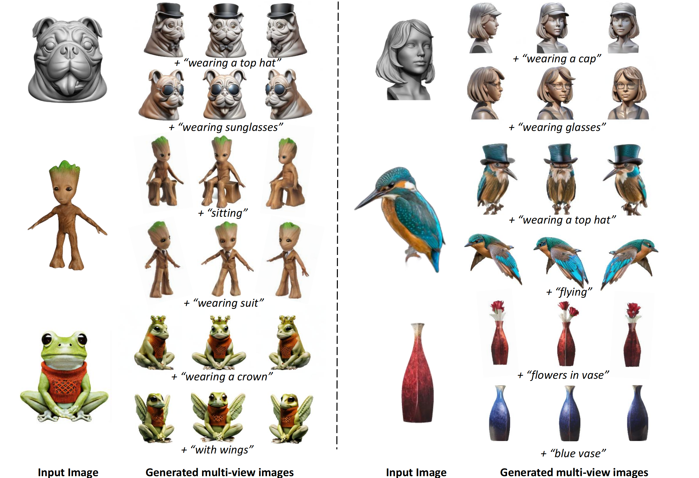
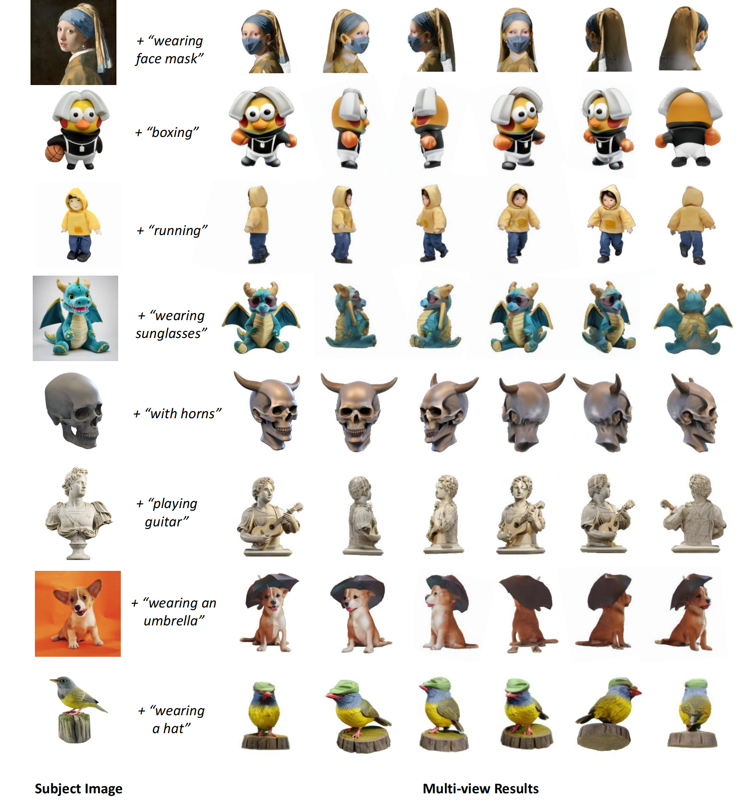

# Make-Your-3D: Fast and Consistent Subject-Driven 3D Content Generation

[**Paper**](https://liuff19.github.io/Make-Your-3D) | [**Project Page**](https://liuff19.github.io/Make-Your-3D//) | [**Video**](https://liuff19.github.io/Make-Your-3D/)

Official implementation of Make-Your-3D: Fast and Consistent Subject-Driven 3D Content Generation

[Fangfu Liu](https://liuff19.github.io/), Hanyang Wang, Weiliang Chen, Haowen Sun, [Yueqi Duan](https://duanyueqi.github.io/)


<p align="center"> All Code will be released soon... 🏗️ 🚧 🔨</p>

Abstract: *Recent years have witnessed the strong power of 3D generation models, which offer a new level of creative flexibility by allowing users to guide the 3D content generation process through a single image or natural language. However, it remains challenging for existing 3D generation methods to create subject-driven 3D content across diverse prompts. In this paper, we introduce a novel 3D customization method, dubbed **Make-Your-3D** that can personalize high-fidelity and consistent 3D content from only a single image of a subject with text description within 5 minutes. Our key insight is to harmonize the distributions of a multi-view diffusion model and an identity-specific 2D generative model, aligning them with the distribution of the desired 3D subject. Specifically, we design a co- evolution framework to reduce the variance of distributions, where each model undergoes a process of learning from the other through identity-aware optimization and subject-prior optimization, respectively. Extensive experiments demonstrate that our method can produce high-quality, consistent, and subject-specific 3D content with text-driven modifications that are unseen in subject image.*

<p align="center">
    
</p>


## Subject-Driven 3D Content Generation

Visual results of Make-Your-3D on different subjects with customized text inputs. The multi-view results demonstrate that our method can generate 3D assets with high-fidelity, 3D consistency, subject preservation, and faithfulness to the text prompts.
<p align="center">
    
</p>


## BibTeX

```bibtex
@misc{liu2024,
      title={Make-Your-3D: Fast and Consistent Subject-Driven 3D Content Generation}, 
      author={Fangfu Liu and Hanyang Wang and Weiliang Chen and Haowen Sun and Yueqi Duan},
      year={2024},
      eprint={2403},
      archivePrefix={arXiv},
      primaryClass={cs.CV}
}
```
